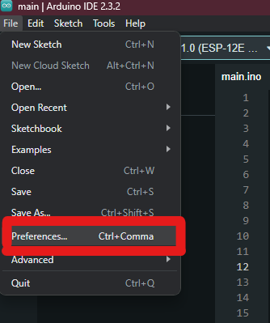

# UltraSoundRuler
This project is a simple program for **ESP 8266 NodeMCU** with *12-E* wifi chip.

## Dependencies
This project utilizes [Liquid Crystal](https://github.com/marcoschwartz/LiquidCrystal_I2C.git) library from [John Rickman](https://github.com/johnrickman)

## How you can use it?
Firstly, this whole project is meant to be uploaded to your device by **Arduino IDE**, meaning if you want to upload this code by yourself, you may encounter issues.

As mentioned, this project is meant to be deployed by **Arduino IDE**, and so to setup:
1. You will need to add a **additional board manager**
2. Install the ESP board package
3. Select the newly installed ESP board package
4. Upload

Finally, project has some variables that are ment to be customized for your personal usage (they don't have)

### Adding a additional board manager
Open your *Arduino IDE*, select **File** at the top left corner and head into **preferences**



In here, you wil add this link *http://arduino.esp8266.com/stable/package_esp8266com_index.json* into the **Additional boards manager URL**


And this part is done!

### Installing the ESP board package
On the left side of *Arduino IDE* is a sidebar. Select **Board Manager** (green higlight)
and look up **"ESP8266"** and install the package.


After installing, you have to select the board too

### Selecting the board
In **Tools** (located top left side of the Arduino IDE) there is *board* option. How to select the proper board is shown on the image below.


### How to upload to your device
To upload your project to your device, you should follow [this](https://support.arduino.cc/hc/en-us/articles/4733418441116-Upload-a-sketch-in-Arduino-IDE) guide

If done right, that's it! Everything should run as clockwork

### Dynamic Values
This program is designed for it to be easier to update certain values (mostly GPIO)

To give an example, ultra sound sensor typicaly has *trigger* and echo *pin*, meaning you have to configure two pins on your chip.

In this project you can find [pins.h](https://github.com/Trup10ka/UltraSoundRuler/blob/main/src/main/pins.h) header file in which is `ULTRA_SOUND_TRIG_PIN` which is used in the whole project and you can easily update this `#define`

Example:
```c
#define PIN_D0 16
#define PIN_D1 5
#define PIN_D5 14
#define PIN_D6 12

/* ... */

/* These defines are for YOU to be customised. You may have different circuit wiring and program operates with these macros, for easier adjustments */
#define ULTRASOUND_TRIG PIN_D6
#define ULTRASOUND_ECHO PIN_D5

#define LCD_SDA PIN_D2
#define LCD_SCL PIN_D1
```

## Scanning for LCD I2C address
Project is based on **'johnrickman'** library [Liquid Crystal](https://github.com/johnrickman/LiquidCrystal_I2C), meaning for this it is required to have LCD display with I2C interface.

This project provides you with the scanner sketch so you can get the I2C address of LCD.

The result address should then be put in [lcd.hpp](https://github.com/Trup10ka/UltraSoundRuler/blob/main/src/main/lcd.hpp)
```c
#define LCD_MEM_ADDRESS <your-address-here>
```